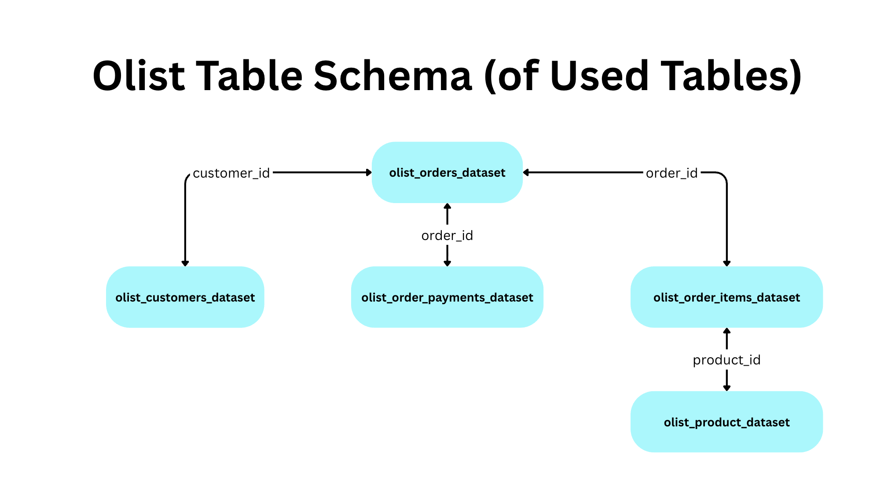
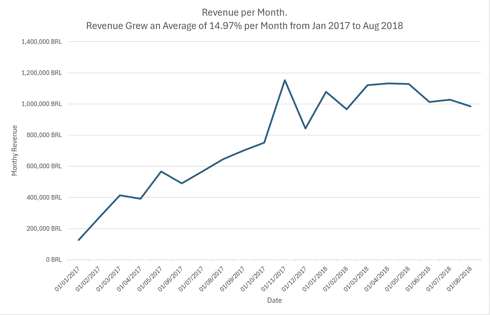
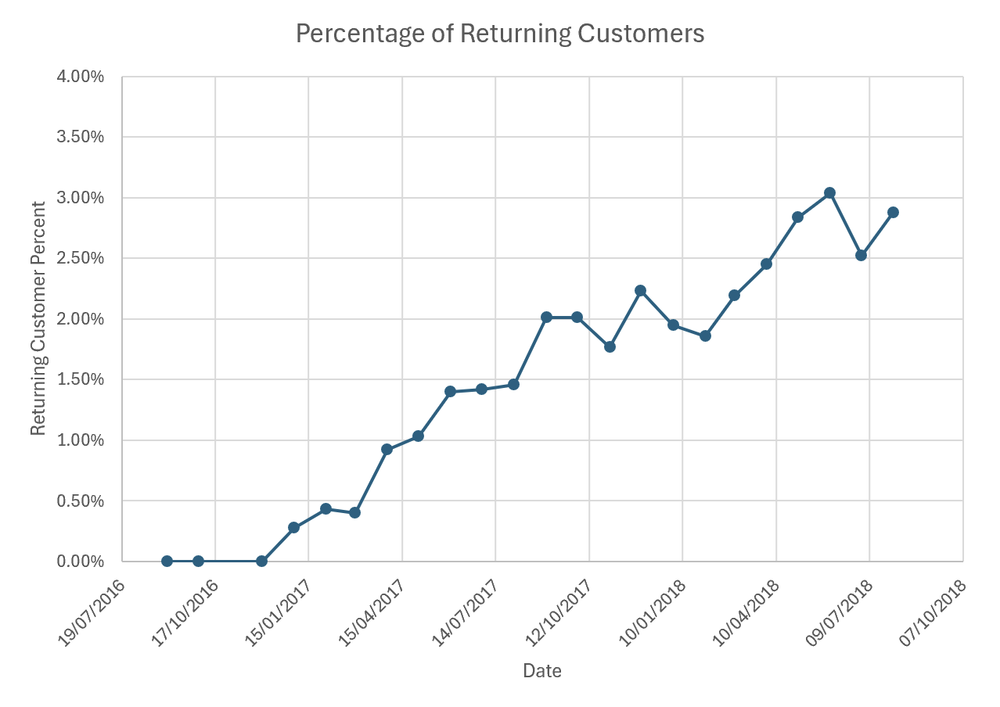
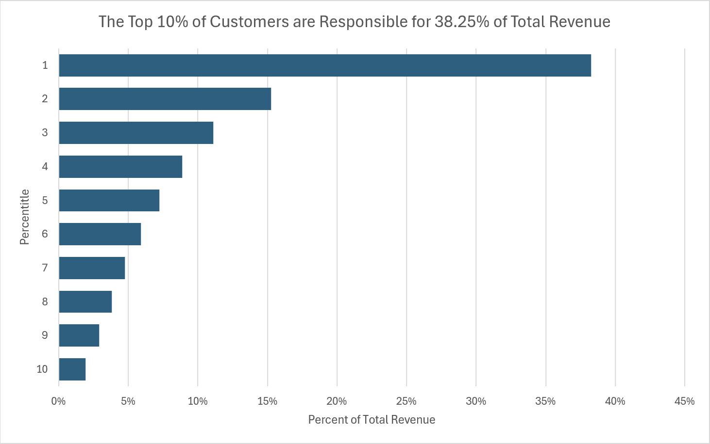
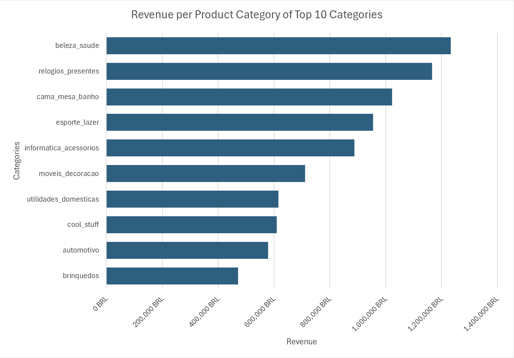
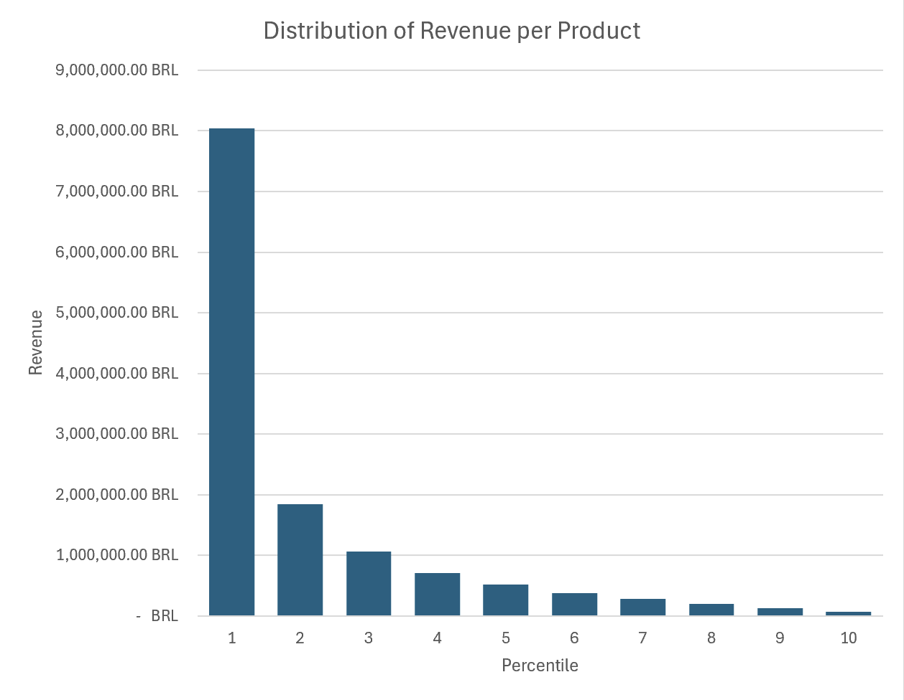

# Olist E-commerce Revenue & Customer Analysis (SQL)

SQL analysis of the Brazilian Olist e-commerce dataset exploring revenue trends, customer behavior, and product performance.

## Key Insights

- Revenue grew rapidly throughout 2017 before plateauing in 2018.
- Customer retention improved steadily despite slower revenue growth.
- Customer spending is highly concentrated: the top 20% of customers generate 54% of revenue.
- Product revenue is also concentrated: the top 10% of products generate over 60% of sales.
---

## Project Overview

This project analyzes the Olist Brazilian e-commerce marketplace dataset from Kaggle.  
Using PostgreSQL, I explored revenue performance, customer behavior, and product sales patterns.

Key goals of the analysis included:
- Understanding revenue growth over time
- Measuring customer lifetime value (LTV)
- Evaluating customer retention
- Identifying high-performing product categories

The project focuses on transforming raw transactional data into business insights using SQL queries and analytical techniques.

## Dataset

Dataset Source:  
https://www.kaggle.com/datasets/olistbr/brazilian-ecommerce

The dataset contains approximately 100k orders from a Brazilian e-commerce marketplace. All revenue and price figures are in Brazilian Reals (denoted with BRL).

Primary tables used in this analysis:

- **orders** – order timestamps and status
- **order_payments** – payment transactions
- **order_items** – individual items within each order
- **customers** – customer information
- **products** – product metadata

The schema for the tables used in this project looks like this:

 

 ## Repository Structure

```
project/
│
├── README.md
├── .gitignore
│
├── sql/
│   ├── queries/           # SQL queries used for revenue, customer, and product analysis
│   ├── database_load/     # SQL scripts used to create tables and load the dataset
│   └── results/           # CSV outputs of queries and Excel workbook used to create charts
│
├── charts/                # Visualizations generated from query results
│
├── docs/                  # Project documentation (table schema diagram)
│
└── data/                  # Raw dataset files from Kaggle
```

## Analysis Workflow

1. Raw data was imported into PostgreSQL using scripts in `sql/database_load/`.
2. Analytical queries were written and organized in `sql/queries/`.
3. Query results were exported to CSV and visualized in Excel.
4. Charts used in this report are stored in the `charts/` directory.

## Key Business Metrics

### Revenue

**Total Revenue:** 15422461.77 BRL

**Average Monthly Revenue Growth Rate:** 14.97%



Revenue grew rapidly throughout 2017 before plateauing in 2018.  
This pattern suggests strong marketplace adoption during the earlier growth phase, followed by a stabilization period in 2018.

### Average Order Value

The average order value is **153.07 BRL** over the entire measured period. It is notable that the average order value increased from 151.40 BRL in 2017 to 154.40 BRL in 2018. 

## Customer Behavior

### Returning Customers



While revenue growth slowed in 2018, the percentage of returning customers continued to increase. This suggests the marketplace may have been transitioning from rapid user acquisition toward improving customer retention.

That said, according to Decile's *2023 Ecommerce Benchmarking Guide* the average retention rate of E-commerce companies is 30%. Much more work could be done to increase the repeat purchase rate.

### Customer Lifetime Value (LTV)
**Average LTV:** 165.20 BRL

**Median LTV:** 107.78 BRL

The median LTV is significantly lower than the average, indicating that the distribution of customer spending is highly skewed. This can be seen in the chart below.



Revenue is highly concentrated among a small portion of customers.  
The top 20% of customers generate approximately 54% of total revenue.

## Product Performance

### Revenue by Product Category



Health & Beauty, Watches & Gifts, and Bed & Bath are the top 3 revenue-generating categories.

### Distribution of Revenue by Product



The top 10% of products generate 60.85% of all revenue.

This suggests that a relatively small portion of the product catalog drives a majority of sales, a common pattern in e-commerce marketplaces.

Understanding which products generate the majority of revenue can help guide inventory prioritization, marketing efforts, and future product offerings.

## SQL Techniques Demonstrated

This project demonstrates several analytical SQL techniques:

- Window functions (`ROW_NUMBER`, `LAG`, `NTILE`)
- Common Table Expressions (CTEs)
- Aggregations and grouped analysis
- Revenue concentration analysis using Lorenz curves and Pareto distributions

### Example SQL Query

```SQL
-- Revenue by product distribution
WITH product_revenue AS (
    SELECT items.product_id AS product,
        prod.product_category_name,
        SUM(items.price) AS revenue_by_product,
        SUM(SUM(items.price)) OVER () AS total_revenue
    FROM olist_order_items_dataset items
        JOIN olist_orders_dataset ord ON ord.order_id = items.order_id
        JOIN olist_products_dataset prod ON prod.product_id = items.product_id
    WHERE ord.order_status = 'delivered'
    GROUP BY product,
        prod.product_category_name
    ORDER BY revenue_by_product DESC
),
ranked AS (
    SELECT product,
        revenue_by_product,
        NTILE(10) OVER (
            ORDER BY revenue_by_product DESC
        ) AS decile
    FROM product_revenue
)
SELECT decile AS product_percentile,
    CONCAT(
        ROUND(
            SUM(revenue_by_product) / SUM(SUM(revenue_by_product)) OVER () * 100,
            2
        ),
        '%'
    ) AS percent_of_total_revenue,
    SUM(revenue_by_product) AS revenue_by_percentile
FROM ranked
GROUP BY product_percentile
ORDER BY product_percentile;
```

## Tools & Technologies

- PostgreSQL 
- SQL 
- VS Code
- Excel